# Administrator Linux Professional Lesson 6

Administrator Linux Professional. NFS, FUSE

## Содержание

- [Administrator Linux Professional Lesson 6](#administrator-linux-professional-lesson-6)
  - [Содержание](#содержание)
  - [Цель](#цель)
  - [Пошаговая инструкция выполнения домашнего задания](#пошаговая-инструкция-выполнения-домашнего-задания)
    - [Что нужно сделать](#что-нужно-сделать)
    - [Задание со звездочкой](#задание-со-звездочкой)
  - [Базовый образ](#базовый-образ)
  - [Установка](#установка)
  - [Скрипты для автоматической настройки](#скрипты-для-автоматической-настройки)

## Цель

Научиться самостоятельно разворачивать сервис NFS и подключать к нему клиентов

## Пошаговая инструкция выполнения домашнего задания

### Что нужно сделать

1. запустить 12 виртуальных машины (сервер NFS и клиента);
2. на сервере NFS должна быть подготовлена и экспортирована директория;
3. в экспортированной директории должна быть поддиректория с именем upload с правами на запись в неё;
4. экспортированная директория должна автоматически монтироваться на клиенте при старте виртуальной машины (systemd, autofs или fstab — любым способом);
5. монтирование и работа NFS на клиенте должна быть организована с использованием NFSv3.

### Задание со звездочкой

Настроить аутентификацию через KERBEROS с использованием NFSv4

## Базовый образ

Для выполнения текущего задания используется базовый образ `Ubuntu 24.04.3 LTS`.

```bash
root@ubuntu:~# uname -r
6.8.0-94-generic
root@ubuntu:~# uname --all
Linux ubuntu 6.8.0-94-generic #96-Ubuntu SMP PREEMPT_DYNAMIC Fri Jan  9 20:36:55 UTC 2026 x86_64 x86_64 x86_64 GNU/Linux
root@ubuntu:~# cat /etc/os-release 
PRETTY_NAME="Ubuntu 24.04.3 LTS"
NAME="Ubuntu"
VERSION_ID="24.04"
VERSION="24.04.3 LTS (Noble Numbat)"
VERSION_CODENAME=noble
ID=ubuntu
ID_LIKE=debian
HOME_URL="https://www.ubuntu.com/"
SUPPORT_URL="https://help.ubuntu.com/"
BUG_REPORT_URL="https://bugs.launchpad.net/ubuntu/"
PRIVACY_POLICY_URL="https://www.ubuntu.com/legal/terms-and-policies/privacy-policy"
UBUNTU_CODENAME=noble
LOGO=ubuntu-logo
```

<table>
<tr><td style="border: 1px solid #777; padding: 10px;">

[VM01]

```bash
ubuntu@ubuntu:~$ uname --all
Linux vm01 6.8.0-94-generic #96-Ubuntu SMP PREEMPT_DYNAMIC Fri Jan  9 20:36:55 UTC 2026 x86_64 x86_64 x86_64 GNU/Linux

ubuntu@ubuntu:~$ hostname
vm01

ubuntu@ubuntu:~$ ip -br a
lo               UNKNOWN        127.0.0.1/8 ::1/128 
enp1s0           UP             192.168.122.174/24 metric 100 fe80::5054:ff:fe9b:4976/64
```

[VM02]

```bash
ubuntu@ubuntu:~$ uname --all
Linux vm02 6.8.0-94-generic #96-Ubuntu SMP PREEMPT_DYNAMIC Fri Jan  9 20:36:55 UTC 2026 x86_64 x86_64 x86_64 GNU/Linux

ubuntu@ubuntu:~$ hostname
vm02

ubuntu@ubuntu:~$ ip -br a
lo               UNKNOWN        127.0.0.1/8 ::1/128 
enp1s0           UP             192.168.122.175/24 metric 100 fe80::5054:ff:fecf:dc4b/64
```

<details>
<summary>📸 Скриншоты кода...</summary>
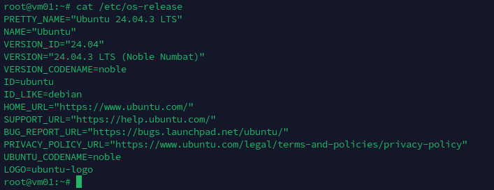
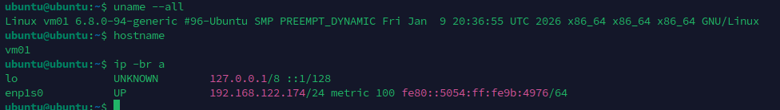
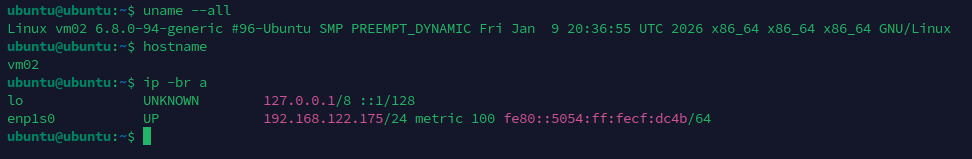
</details>

</td></tr>
</table>

Далее принимаем, что `VM01` будет сервером, а `VM02` - клиентом.

## Установка

Устанавливаем сервер на VM01

<table>
<tr><td style="border: 1px solid #777; padding: 10px;">

```bash
sudo apt update && sudo apt install -y nfs-kernel-server
ss -tulpn | grep -E ":2049|:111"
```

<details>
<summary>📸 Скриншот кода...</summary>
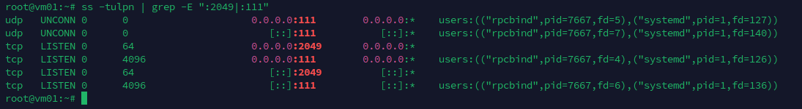
</details>

</td></tr>
</table>

Создаем папку для экспорта `/srv/share/upload` и выдаем ей права для загрузки:

<table>
<tr><td style="border: 1px solid #777; padding: 10px;">

```bash
mkdir -p /srv/share/upload
chown -R nobody:nogroup /srv/share
chmod 0777 /srv/share/upload
```

<details>
<summary>📸 Скриншот кода...</summary>
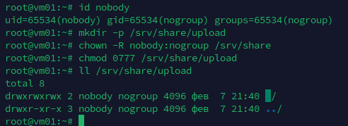
</details>

</td></tr>
</table>

Добавляем в файл настроек доступа `/etc/exports` к папке по NFS разрешения для VM02:

<table>
<tr><td style="border: 1px solid #777; padding: 10px;">

```bash
cat >> /etc/exports <<EOF
/srv/share 192.168.122.175/32(rw,sync,root_squash)
EOF

# Show changes
cat /etc/exports | grep -vE "^#|^$"
```

<details>
<summary>📸 Скриншот кода...</summary>
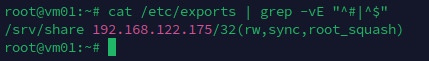
</details>

</td></tr>
</table>

Экспортируем папку. И проверяем наши настройки:

<table>
<tr><td style="border: 1px solid #777; padding: 10px;">

```bash
exportfs -r
exportfs -s
```

<details>
<summary>📸 Скриншот кода...</summary>
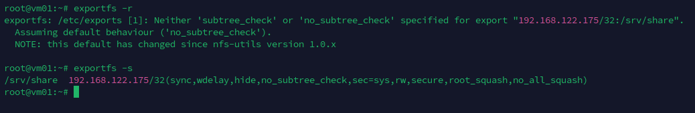
</details>

</td></tr>
</table>

Устанавливаем на клиенте `VM02` пакет `nfs-common`. Монтируем в `/etc/fstab` наш каталог на сервере `VM01`:

<table>
<tr><td style="border: 1px solid #777; padding: 10px;">

```bash
sudo apt install nfs-common
mkdir -p /mnt/vm01
echo "192.168.122.174:/srv/share/ /mnt/vm01 nfs vers=3,noauto,x-systemd.automount 0 0" >> /etc/fstab
systemctl daemon-reload
systemctl restart remote-fs.target
```

<details>
<summary>📸 Скриншоты кода...</summary>
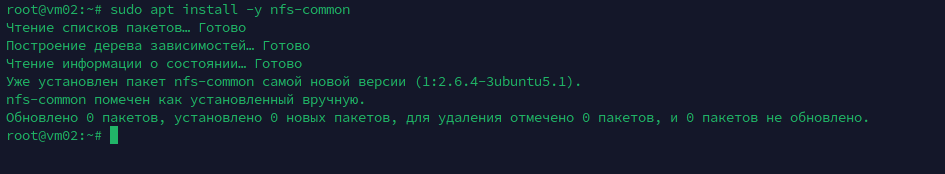
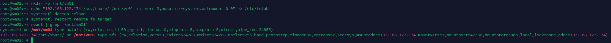
</details>

</td></tr>
</table>

После чего проверяем, что файлы доступны

<table>
<tr><td style="border: 1px solid #777; padding: 10px;">

[VM01]

```bash
touch test.file
touch ./upload/test_upload.file
tree ./
```

<details>
<summary>📸 Скриншот кода...</summary>
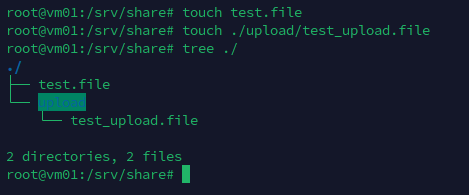
</details>

[VM02]

```bash
tree ./
mount | grep '/mnt/vm01'
touch ./upload/to_server.txt
tree ./
```

<details>
<summary>📸 Скриншот кода...</summary>
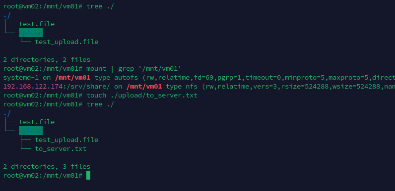
</details>

</td></tr>
</table>

## Скрипты для автоматической настройки

Для сервера [VM01] скрипт `./scripts/nfss_script_vm01_server.sh`

Для клиента [VM02] скрипт `./scripts/nfsc_script_vm02_client.sh`
